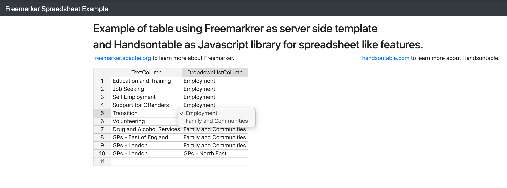

# Freemarker + Sprig Boot Spreadsheet Example

This project demonstrate the use of Freemarkrer as server side template.

Handsontable is used as Javascript library for spreadsheet like features, not requiring any Javascript framework.

## Getting Started

These instructions will get you a copy of the project up and running on your local machine for development and testing purposes. See deployment for notes on how to deploy the project on a live system.

### Prerequisites

What things you need to install:

```
Java 7 or higher
```
```
Maven 3 or higher
```

### Starting the app

Using 

```
mvn spring-boot:run
```

You should get a result similar to:

